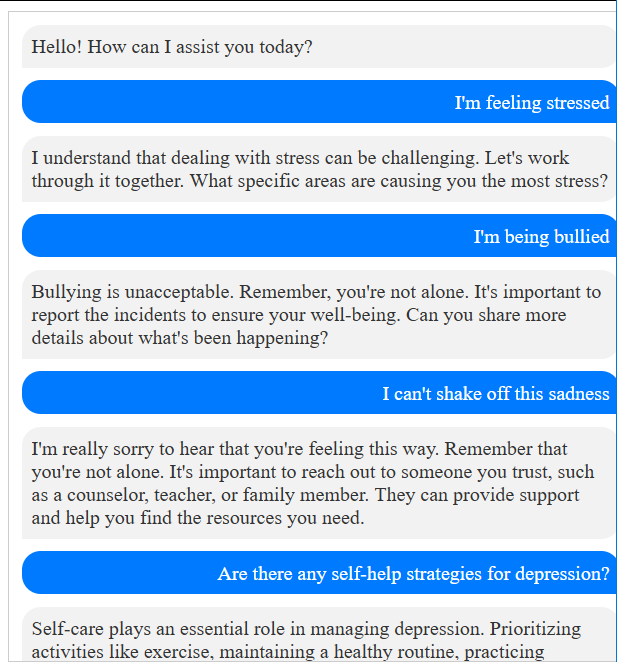

## AI Chat Bot
#### The purpose of this project is to:
Develop an AI Chatbot that provides support and guidance to students experiencing mental health issues.
Issues related to anxiety, stress, and depression, among other mental health challenges.

Leverage natural language processing (NLP) techniques and a user-centered approach to converse with the bot. 

Direct students to relevant mental health resources, such as helpline numbers and counseling services.

Implement privacy and security measures to protect user data, ensuring confidentiality. 

While the Chatbot aims to be a helpful tool, it explicitly emphasizes that it is not a substitute for professional assistance, urging users to seek appropriate help when needed.
